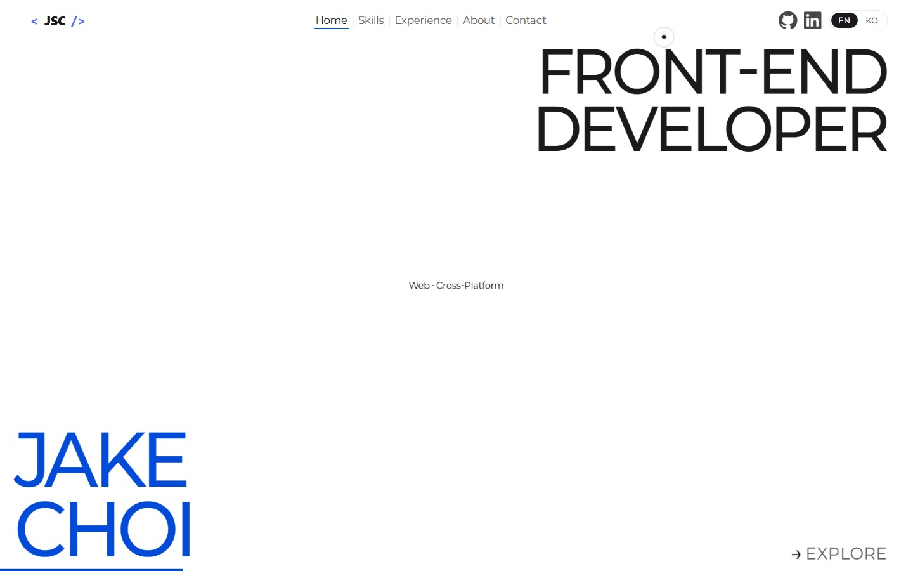
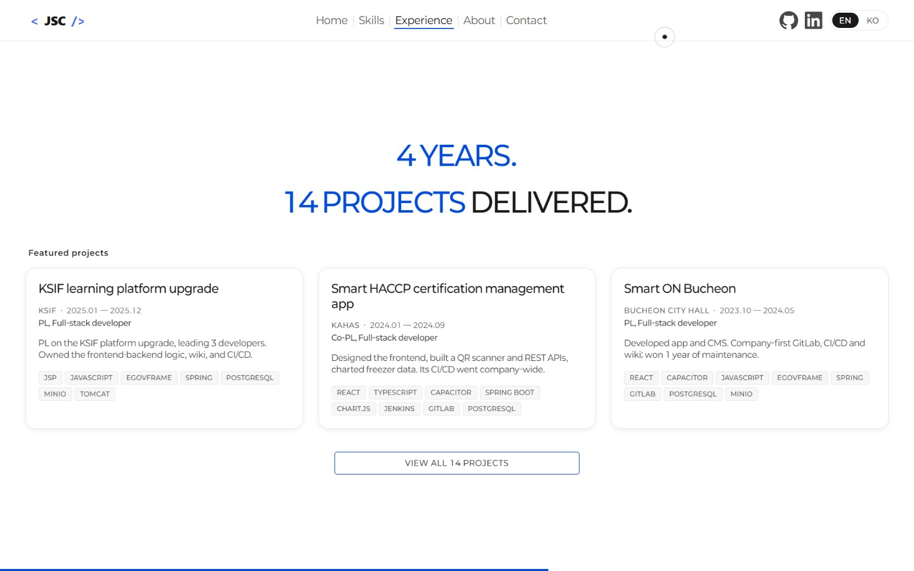

# Jake Choi (최정수) — Developer Portfolio

A personal portfolio site built as a five-slide horizontal deck, in English and Korean.

**Live at [angrg26.github.io](https://angrg26.github.io)**





---

## About

I am a frontend-centric full-stack developer with 4 years and 2 months of experience,
working mainly in React and TypeScript. I have delivered 14 public-sector and research
projects with 100% on-time delivery, and led 5 of them as PL or co-PL. Korean native,
English at native level.

This site is where that work is presented. Full detail lives on the site itself — the
Experience slide and its project overlay list all 14.

---

## Built with

Plain HTML, CSS, and JavaScript. That is the whole stack.

- **No framework, no build step, no `package.json`, no dependencies.** Nothing to install
  and nothing to compile. What is in this repository is exactly what the browser runs.
- **No external requests.** The Paperlogy typeface is self-hosted from `assets/fonts/`, so
  the site makes no third-party calls and renders the same offline.
- **Deployed by GitHub Pages.** A push to `main` is the deploy. There is no pipeline.

The constraint was deliberate. A portfolio that loads a framework to move five panels is
carrying weight it never uses, and the interesting problems here — viewport behaviour,
the cascade, input capability, history — are ones a framework would have hidden rather
than solved.

---

## What it does

- Five slides — Home, Skills, Experience, About, Contact — moving horizontally on wheel,
  touch swipe, arrow keys, or the nav.
- An English/Korean toggle that swaps every visible string and remembers the choice.
- Full-project-list and About overlays wired to the browser Back button.
- A custom two-dot cursor on pointer devices, disabled where there is no mouse.
- A reveal cascade that plays once per slide, per session.
- Responsive from desktop down to phone portrait.

---

## Engineering notes

The problems worth writing down, and what actually caused them. Most were not visible on
a desktop browser at all.

### The bottom of every slide was cut off on a real phone

**Issue.** The bottom-anchored name, scroll cue, and slide copy sat off the bottom edge on
a physical phone, and the last ~47px of the Skills and Experience scroll containers could
not be reached even at maximum scroll. Desktop looked perfect.

**Cause.** `100vh` resolves against the _large_ viewport — the height with the URL bar
retracted. But `html` and `body` are `overflow: hidden` here, so the deck never scrolls,
so the browser toolbars never retract. Every slide was permanently laid out 100–130px
taller than the area actually visible, and `.slide`'s own `overflow: hidden` clipped the
difference with no scroll left to recover it.

**Fix.** `svh` — the _small_ viewport, the height with browser chrome showing, which is
the height genuinely visible here. Not `dvh`: that tracks toolbars live and would resize
the whole five-slide flex row mid-gesture. Since the toolbars can never retract, `svh` is
both stable and exact. The `100vh` declarations stay underneath as a fallback.

### A scrollbar that scrolled to nothing

**Issue.** On first arrival at a slide, a horizontal scrollbar appeared, scrolled to
nothing, and took a ~10px vertical layout shift with it — for exactly as long as the
reveal animation ran.

**Cause.** Two behaviours meeting. Setting `overflow-y: auto` silently promotes an unset
`overflow-x` from `visible` to `auto`. And every element waiting to be revealed sits at
`transform: translateX(48px)` until the slide engine adds its class — a transformed
descendant counts toward scrollable overflow at any depth. So the container dutifully
offered to scroll to content that was about to animate into place.

**Fix.** An explicit `overflow-x: hidden` on the three scroll containers. It reads as
redundant next to `overflow-y`, and it is not — removing it brings the flicker straight
back.

### Touchscreen laptops had no cursor at all

**Issue.** On a laptop with both a touchscreen and a real mouse, there was no visible
cursor anywhere on the site. Not the custom one, not the system arrow.

**Cause.** A hybrid device matches `(pointer: coarse)`, so the custom cursor was hidden as
though it were a phone — while the stylesheets still set `cursor: none` on interactive
elements to hide the native arrow behind a custom cursor that was no longer there. The
touch restore that should have caught this lost a specificity tie at (0,1,0) to a later
stylesheet, purely on load order.

**Fix.** Qualifying the restore selectors with `html`, raising them above every later
`cursor: none` regardless of source order.

### Cards snapped into place instead of fading in

**Issue.** Adding a `box-shadow` transition to a card silently cost it its entire entrance
animation. The card jumped into position.

**Cause.** `transition` is one property. A later rule at equal specificity that declares
`transition` replaces the whole thing rather than adding to it — so declaring
`box-shadow` alone discarded the inherited `opacity` and `transform` transitions
completely.

**Fix.** Every override restates `opacity` and `transform` alongside whatever it is
adding, with matching easing so the deck still moves as one piece.

### Back closed the page instead of the overlay

**Issue.** With the project overlay open, the browser Back button left the site entirely
rather than closing the overlay. Separately, the overlay slid off-screen with the deck
instead of sitting over it, and appeared instantly with no transition.

**Cause.** Three distinct things. Opening the overlay did not touch history at all. The
overlay was nested inside the deck wrapper, which carries an inline `transform` on every
navigation — and a transformed ancestor becomes the containing block for `position: fixed`
descendants, so "fixed" was fixed relative to a moving element. And removing `hidden` and
adding the open class in one frame gave the browser a single style resolution, leaving no
start state to transition from.

**Fix.** Open and close both route through history, so the Back button and the on-screen
BACK control are one code path, with `popstate` as the only place that closes. The overlay
became a sibling of the deck rather than a child — no CSS could have fixed that, only the
markup placement. And two nested `requestAnimationFrame` calls give the transition a start
state to animate from.

### Korean text ignored the responsive rules

**Issue.** Responsive overrides for the contact headline applied in English and were
silently ignored in Korean.

**Cause.** The Korean size is set by `html[lang="ko"] .contact-headline` at (0,2,1). A
plain `.contact-headline` in the responsive stylesheet is (0,1,0). Specificity decides
before source order ever gets a say, so the override never applied in Korean — and a
media query adds no specificity to help.

**Fix.** Any responsive override of a bilingual headline names both language variants.

---

## Structure

```
index.html          all markup, including both overlays
css/
  base.css          resets, shared reveal transitions, custom properties
  cursor.css        custom cursor, and the touch-device restore
  nav.css           top nav, language toggle, active underline
  slides.css        the five-slide flex row
  hero.css          Home
  skills.css        Skills
  experience.css    Experience
  about.css         About
  contact.css       Contact
  projects.css      full-project-list overlay
  about-detail.css  About detail overlay
  responsive.css    every breakpoint, loaded last
js/
  cursor.js         two-dot cursor, gated on input capability
  slides.js         slide engine: wheel, touch, keyboard, reveals
  language.js       EN/KO swap over data-en / data-ko attributes
  projects.js       shared overlay controller, routed through history
assets/
  fonts/            Paperlogy, five weights, self-hosted
  icon/             logo and social marks
  images/           About photography
  screenshots/      the preview images above
```

Stylesheet load order matters and is fixed in `index.html`. `responsive.css` is last on
purpose: a media query adds no specificity, so an override inside one only beats an
identical selector by arriving later.

Copy is bilingual through paired `data-en` and `data-ko` attributes on the elements
themselves — `js/language.js` only swaps between them and holds no strings of its own.
Editing visible text means editing both attributes.
